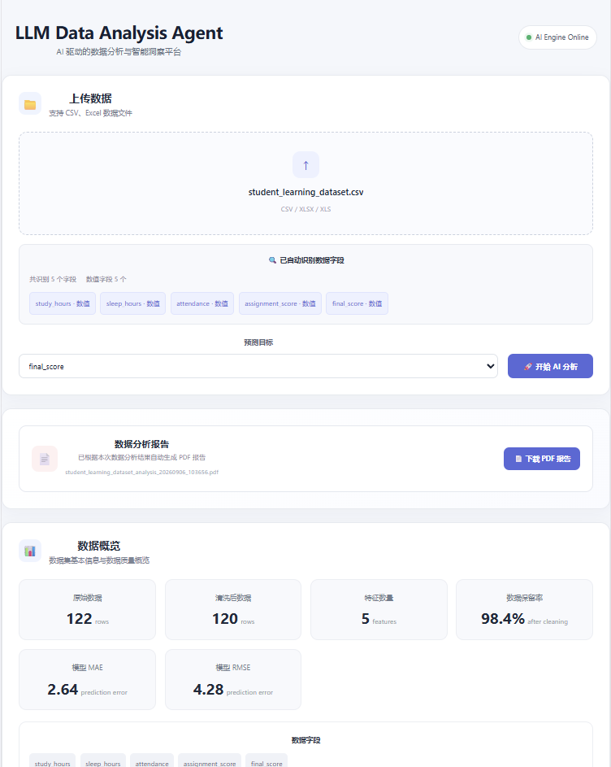
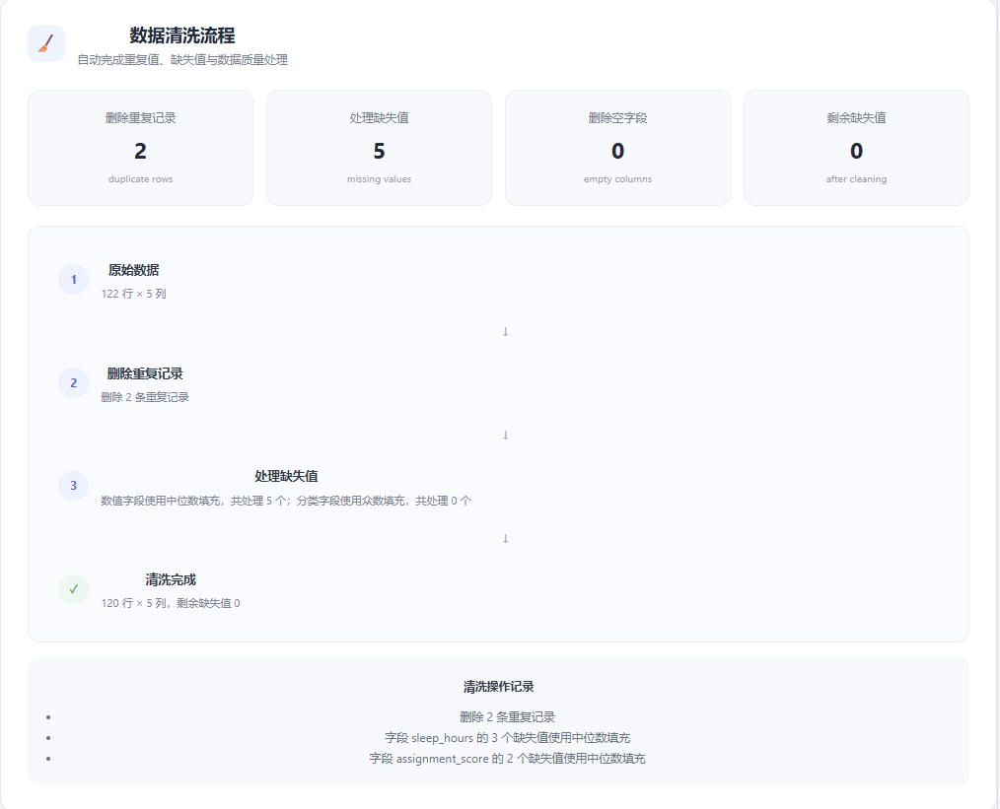
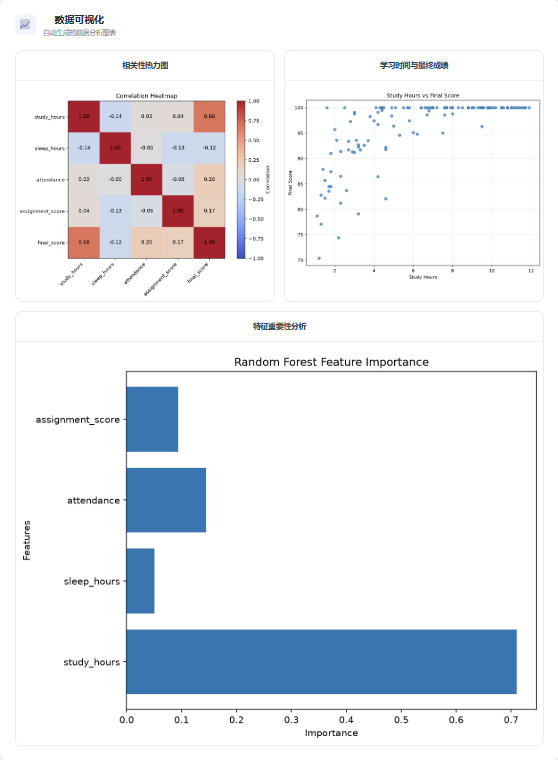
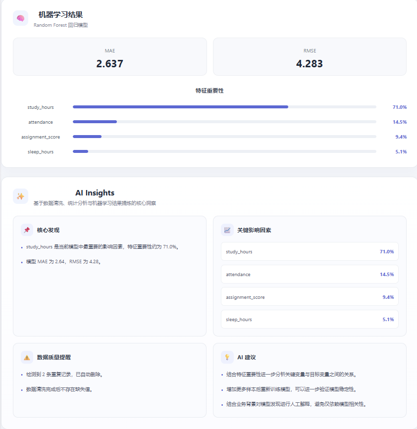
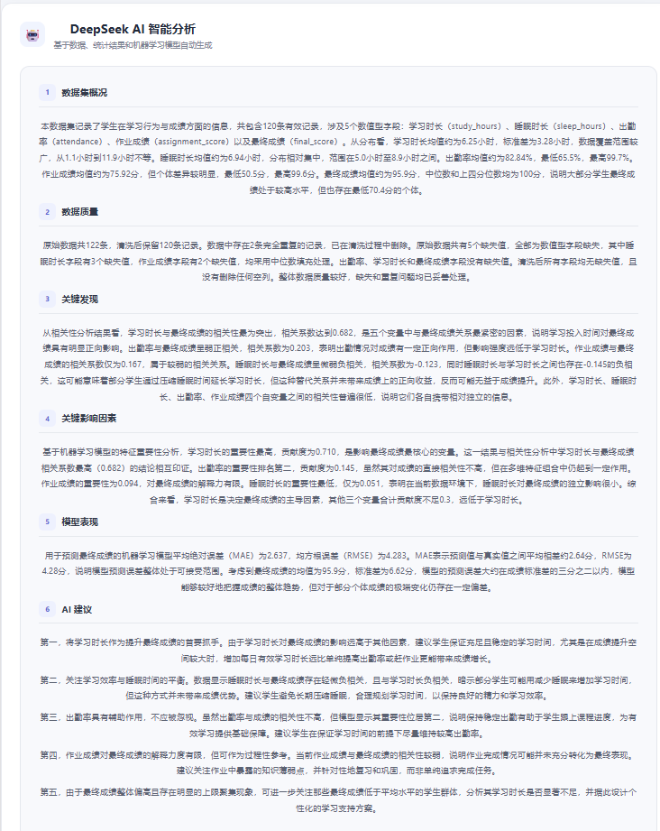
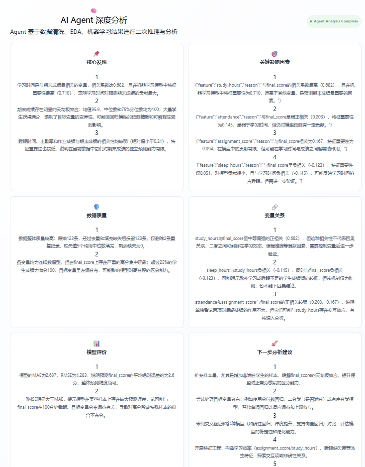

# LLM Data Analysis Agent

AI-powered data analysis platform that combines automated data cleaning, exploratory data analysis (EDA), machine learning, visualization, and large language model reasoning into a unified workflow.

The project is designed to transform raw tabular data into structured statistical insights, machine learning results, visualizations, and natural-language analytical reports.

---

## Overview

The LLM Data Analysis Agent is an end-to-end intelligent data analysis system.

Users can upload CSV or Excel datasets and specify a prediction target. The system automatically performs:

1. Data loading
2. Data cleaning
3. Exploratory data analysis
4. Statistical analysis
5. Data visualization
6. Machine learning
7. AI-generated insights
8. AI Agent deep analysis
9. PDF report generation

The project combines traditional data science methods with Large Language Models (LLMs) to create an automated analytical workflow.

---

## Screenshots

### Dashboard



### Data Cleaning



### Data Visualization



### Machine Learning



### AI Insights



### AI Agent Deep Analysis



---

## Key Features

### Automated Data Cleaning

The system automatically detects and processes common data quality issues.

Supported operations include:

- Duplicate row detection and removal
- Missing value detection
- Numerical missing value imputation using median values
- Categorical missing value imputation using mode values
- Completely empty column removal
- Data quality reporting

Example cleaning result:

- Original rows: 122
- Cleaned rows: 120
- Duplicate rows removed: 2
- Missing values handled: 5
- Remaining missing values: 0

---

### Exploratory Data Analysis

The EDA module automatically generates:

- Descriptive statistics
- Data types
- Missing-value statistics
- Correlation matrix
- Numerical variable relationships

For numerical variables, the system calculates:

- Count
- Mean
- Standard deviation
- Minimum
- Maximum
- Quartiles

---

### Data Visualization

The system automatically generates analytical visualizations including:

- Correlation heatmap
- Feature relationship plots
- Feature importance charts

The visualization pipeline is implemented using Matplotlib and is designed to provide interpretable outputs for both users and downstream AI analysis.

---

### Machine Learning

The current machine learning pipeline uses a Random Forest regression model.

The system automatically:

1. Selects numerical features
2. Separates features and target
3. Splits the dataset into training and testing sets
4. Trains a Random Forest regression model
5. Generates predictions
6. Calculates evaluation metrics
7. Extracts feature importance

The current example uses:

**Target variable:**

`final_score`

**Features:**

- `study_hours`
- `sleep_hours`
- `attendance`
- `assignment_score`

---

### AI Insights

The system uses a Large Language Model to interpret:

- Data quality
- Statistical relationships
- Machine learning results
- Feature importance
- Model performance
- Potential analytical limitations
- Possible next-step analyses

The AI does not replace statistical or machine learning calculations.

Instead, the LLM acts as an interpretation layer on top of structured analytical results.

---

### AI Analysis Agent

The project also contains a dedicated AI Analysis Agent.

Unlike simple text generation, the Agent receives structured outputs from:

- Data cleaning
- EDA
- Correlation analysis
- Machine learning
- Model evaluation
- Feature importance

The Agent then produces a structured analytical report.

The Agent is explicitly instructed to distinguish:

- Correlation from causation
- Predictive importance from causal effects
- Statistical observations from conclusions

It also identifies potential issues such as:

- Ceiling effects
- Dataset size limitations
- Model uncertainty
- Potential feature limitations

---

## System Architecture

```text
                    ┌─────────────────────┐
                    │      User Upload     │
                    │   CSV / Excel File   │
                    └──────────┬──────────┘
                               │
                               ▼
                    ┌─────────────────────┐
                    │    Data Processor    │
                    │   Load & Validation  │
                    └──────────┬──────────┘
                               │
                               ▼
                    ┌─────────────────────┐
                    │    Data Cleaner      │
                    │                     │
                    │ • Duplicate Removal │
                    │ • Missing Values    │
                    │ • Empty Columns     │
                    └──────────┬──────────┘
                               │
                ┌──────────────┼──────────────┐
                │              │              │
                ▼              ▼              ▼
        ┌──────────────┐ ┌──────────────┐ ┌──────────────┐
        │     EDA      │ │ Visualization│ │ Machine      │
        │              │ │              │ │ Learning     │
        │ Statistics   │ │ Heatmap      │ │ RandomForest │
        │ Correlation  │ │ Relationships│ │ Regression   │
        └──────┬───────┘ └──────┬───────┘ └──────┬───────┘
               │                │                │
               └────────────────┼────────────────┘
                                │
                                ▼
                     ┌─────────────────────┐
                     │     AI Insights     │
                     │      LLM Layer      │
                     └──────────┬──────────┘
                                │
                                ▼
                     ┌─────────────────────┐
                     │   AI Analysis Agent │
                     │                     │
                     │ Structured Reasoning│
                     │ Interpretation      │
                     │ Recommendations     │
                     └──────────┬──────────┘
                                │
                                ▼
                     ┌─────────────────────┐
                     │    Final Report     │
                     │   Dashboard / PDF   │
                     └─────────────────────┘
```

---

## Technology Stack

### Backend

- Python
- FastAPI
- Pandas
- NumPy
- Scikit-learn
- Matplotlib
- OpenAI-compatible API
- DeepSeek API

### Frontend

- React
- Vite
- JavaScript
- CSS

### Machine Learning

- Random Forest Regression
- Train/Test Split
- MAE
- RMSE
- Feature Importance

### AI

- Large Language Model
- DeepSeek API
- Structured JSON reasoning
- AI Analysis Agent

---

## Project Structure

```text
LLM-Data-Analysis-Agent/
│
├── backend/
│   ├── api.py
│   ├── main.py
│   ├── data_processor.py
│   ├── data_cleaner.py
│   ├── eda.py
│   ├── ml_model.py
│   ├── visualizations.py
│   ├── llm_analyzer.py
│   ├── analysis_agent.py
│   ├── pdf_report.py
│   ├── requirements.txt
│   │
│   ├── uploads/
│   │   └── student_learning_dataset.csv
│   │
│   └── outputs/
│
├── frontend/
│   ├── src/
│   │   ├── App.jsx
│   │   ├── App.css
│   │   └── ...
│   │
│   ├── package.json
│   └── ...
│
├── screenshots/
│   ├── dashboard.png
│   ├── data-cleaning.png
│   ├── visualization.png
│   ├── machine-learning.png
│   ├── ai-insights.png
│   └── ai-agent.png
│
├── .gitignore
└── README.md
```

---

## Example Analysis

The included demonstration dataset contains student learning-related variables.

### Dataset

The dataset contains the following variables:

| Variable | Description |
|---|---|
| `study_hours` | Study time |
| `sleep_hours` | Sleep duration |
| `attendance` | Attendance rate |
| `assignment_score` | Assignment performance |
| `final_score` | Final score |

The prediction target is:

`final_score`

---

## Data Cleaning

The original dataset contained:

- 122 rows
- 5 columns
- 2 duplicate rows
- 5 missing values

After cleaning:

- 120 rows
- 5 columns
- 0 duplicate rows
- 0 remaining missing values

### Cleaning Strategy

Duplicate records are removed first.

For numerical columns:

```text
Missing values → Median imputation
```

For categorical columns:

```text
Missing values → Mode imputation
```

Completely empty columns are removed automatically.

The system also generates a structured cleaning report describing every cleaning operation.

---

## Machine Learning Results

The current demonstration uses a Random Forest regression model to predict `final_score`.

### Model Configuration

```text
Model:
Random Forest Regressor

Number of Trees:
100

Test Size:
20%

Random State:
42
```

### Evaluation Metrics

| Metric | Result |
|---|---:|
| MAE | 2.637 |
| RMSE | 4.283 |

The model achieved a relatively low MAE on the demonstration dataset.

RMSE is higher than MAE, indicating that some prediction errors are larger than the typical absolute error.

---

## Feature Importance

The Random Forest model produced the following feature importance results:

| Feature | Importance |
|---|---:|
| `study_hours` | 71.0% |
| `attendance` | 14.5% |
| `assignment_score` | 9.4% |
| `sleep_hours` | 5.1% |

The model identifies `study_hours` as the strongest predictive feature among the variables included in this example.

However, feature importance should not be interpreted as a causal effect.

For example:

```text
High feature importance
        ≠
Causal relationship
```

---

## Statistical Findings

The correlation analysis produced the following relationships with `final_score`:

| Variable | Correlation with `final_score` |
|---|---:|
| `study_hours` | 0.682 |
| `attendance` | 0.203 |
| `assignment_score` | 0.167 |
| `sleep_hours` | -0.123 |

The strongest observed linear relationship is between `study_hours` and `final_score`.

However, correlation alone cannot establish causality.

Possible explanations may include:

- Confounding variables
- Selection effects
- Measurement limitations
- Dataset characteristics

Therefore, the AI Agent explicitly avoids making causal claims based only on correlation.

---

## Data Quality Considerations

The demonstration dataset contains a relatively small number of observations.

After cleaning:

```text
120 observations
5 numerical variables
```

This means the results should be interpreted as an analytical demonstration rather than a general conclusion about student performance.

Another important issue is the distribution of `final_score`.

The analysis detected a potential ceiling effect because a large number of observations are concentrated near the maximum score.

This can reduce the ability of both correlation analysis and regression models to distinguish high-performing observations.

---

## AI Analysis Agent

The AI Analysis Agent combines statistical analysis and machine learning results into a structured reasoning workflow.

### Agent Inputs

The Agent receives:

- Dataset dimensions
- Data cleaning report
- Descriptive statistics
- Correlation matrix
- Machine learning metrics
- Feature importance
- Data quality information

### Agent Reasoning

The Agent evaluates:

1. Data quality
2. Statistical relationships
3. Predictive factors
4. Model performance
5. Potential limitations
6. Future analytical directions

### Agent Output

The Agent returns structured sections including:

```text
core_findings
key_factors
data_quality
relationships
model_evaluation
next_analysis
```

This structured output makes the AI reasoning easier to display in the frontend and easier to reuse in reports.

---

## Example Agent Output

The Agent identified the following major findings:

### Core Finding

`study_hours` is the strongest predictive factor for `final_score` in the current Random Forest model.

### Relationship

`study_hours` has a correlation of approximately:

```text
0.682
```

with `final_score`.

### Data Quality

The dataset contained:

```text
2 duplicate rows
5 missing values
```

After cleaning:

```text
120 complete observations
0 remaining missing values
```

### Model Evaluation

```text
MAE  = 2.6367
RMSE = 4.2828
```

### Important Limitation

The high concentration of `final_score` values near the maximum suggests a potential ceiling effect.

### Recommended Next Analysis

The Agent recommends:

- K-fold cross-validation
- Residual analysis
- Model comparison
- Feature interaction analysis
- Classification or quantile-based modeling
- Additional background variables
- Larger datasets

---

## Running Locally

### 1. Clone the Repository

```bash
git clone https://github.com/Fmhapppy/LLM-Data-Analysis-Agent.git
cd LLM-Data-Analysis-Agent
```

---

### 2. Create a Python Virtual Environment

```bash
python -m venv .venv
```

Activate it on Windows:

```powershell
.venv\Scripts\Activate.ps1
```

---

### 3. Install Backend Dependencies

```bash
cd backend
pip install -r requirements.txt
```

---

### 4. Configure the AI API

Create:

```text
backend/.env
```

Add your API key:

```env
DEEPSEEK_API_KEY=your_api_key_here
```

Do not commit `.env` or API keys to GitHub.

The repository uses `.gitignore` to exclude environment variables and generated files.

---

### 5. Start the Backend

From the `backend` directory:

```bash
uvicorn api:app --reload
```

The backend will normally run at:

```text
http://127.0.0.1:8000
```

---

### 6. Start the Frontend

Open another terminal and enter the frontend directory:

```bash
cd frontend
npm install
npm run dev
```

The Vite development server will provide the frontend URL in the terminal.

---

## API Overview

### Health Check

```http
GET /
```

Returns the basic service status.

---

### Dataset Inspection

```http
POST /inspect
```

Used to inspect uploaded datasets before running the full analysis pipeline.

---

### Full Analysis

```http
POST /analyze
```

The main analysis endpoint.

It performs:

```text
Upload
  ↓
Data Cleaning
  ↓
EDA
  ↓
Machine Learning
  ↓
Visualization
  ↓
AI Analysis
  ↓
AI Agent
  ↓
PDF Report
```

---

## Analysis Pipeline

The backend logs each stage of the analysis pipeline.

```text
[1/9] Load dataset
[2/9] Check target column
[3/9] Clean data
[4/9] Perform EDA
[5/9] Train machine learning model
[6/9] Generate visualizations
[7/9] Generate AI analysis
[8/9] Run AI Analysis Agent
[9/9] Generate PDF report
```

This makes the backend workflow easier to debug and understand.

---

## Design Principles

### 1. Separate Computation from Interpretation

Statistical calculations and machine learning metrics are calculated programmatically.

The LLM is responsible for interpretation rather than inventing numerical results.

---

### 2. Structured AI Output

The AI Agent produces structured JSON rather than relying entirely on free-form text.

This allows the frontend to display analytical sections consistently.

---

### 3. Reproducible Analysis

Machine learning uses a fixed random state:

```text
random_state = 42
```

This improves reproducibility of the demonstration results.

---

### 4. Explicit Data Quality Handling

Data cleaning is treated as an independent stage instead of being hidden inside the AI analysis process.

This makes the analytical pipeline more transparent.

---

### 5. Avoiding Causal Overinterpretation

The system explicitly distinguishes:

```text
Correlation
        ≠
Causation
```

and:

```text
Feature Importance
        ≠
Causal Effect
```

This is an important principle when combining AI with data analysis.

---

## Future Improvements

Potential future development includes:

### Machine Learning

- Cross-validation
- XGBoost
- LightGBM
- Gradient Boosting
- Neural networks
- Automated model comparison
- Hyperparameter optimization

### Data Analysis

- Automatic outlier detection
- Automatic categorical encoding
- Feature engineering
- Feature interaction analysis
- Time-series analysis
- Statistical significance testing

### AI Agent

- Multi-agent analytical workflow
- Tool calling
- Automated model selection
- Automated hypothesis generation
- Automatic follow-up analysis
- More reliable numerical verification

### Visualization

- Interactive Plotly charts
- Dynamic filtering
- Interactive correlation analysis
- Interactive feature importance
- More visualization types

### Reporting

- More detailed PDF reports
- Export to Excel
- Export to Markdown
- Automatic executive summaries
- Custom report templates

---

## Limitations

This project is currently a prototype and demonstration system.

Important limitations include:

### Dataset Size

The example dataset contains only 120 cleaned observations.

This is insufficient for making broad real-world conclusions.

### Ceiling Effect

The target variable contains many high scores near the maximum value.

This may reduce the effectiveness of standard regression and correlation analysis.

### Feature Availability

The demonstration dataset contains only a small number of variables.

Real-world performance may depend on many additional factors.

### Model Scope

The current system primarily uses Random Forest regression.

More extensive model comparison would be required for production-level analysis.

### LLM Reliability

LLM-generated interpretations should always be checked against the underlying numerical results.

The LLM should be treated as an analytical assistant rather than an unquestionable source of truth.

---

## Learning Outcomes

This project provided practical experience in:

- Python backend development
- FastAPI
- REST API design
- Pandas
- Data cleaning
- Exploratory data analysis
- Statistical correlation analysis
- Data visualization
- Machine learning
- Random Forest regression
- Model evaluation
- Feature importance analysis
- Large Language Models
- Prompt engineering
- AI Agent design
- React frontend development
- Full-stack integration
- PDF report generation
- Git and GitHub
- AI-assisted software engineering

---

## Project Motivation

The motivation behind this project is to explore how traditional data science workflows can be combined with modern AI systems.

Traditional data analysis often requires users to manually perform multiple steps:

```text
Data Cleaning
      ↓
EDA
      ↓
Visualization
      ↓
Machine Learning
      ↓
Interpretation
      ↓
Report Writing
```

This project attempts to automate the entire workflow:

```text
Raw Dataset
      ↓
Automated Analysis
      ↓
Machine Learning
      ↓
AI Interpretation
      ↓
AI Agent Reasoning
      ↓
Final Report
```

The goal is not to replace data scientists, but to build an intelligent assistant that reduces repetitive analytical work while keeping numerical computation transparent and reproducible.

---

## Why This Project Matters

The project combines several areas of modern software engineering and artificial intelligence:

```text
Software Engineering
        +
Data Science
        +
Machine Learning
        +
Large Language Models
        +
AI Agents
        +
Full-Stack Development
```

This makes the project a practical exploration of how AI can be integrated into real analytical applications.

---

## Repository

GitHub:

https://github.com/Fmhapppy/LLM-Data-Analysis-Agent

---

## Author

**Fmhapppy**

Software Engineering student interested in:

- Artificial Intelligence
- Machine Learning
- Data Science
- LLM Applications
- AI Agents
- Full-Stack Development

---

## License

This project is intended for learning, research, and portfolio purposes.

If you reuse or extend this project, please provide appropriate attribution.